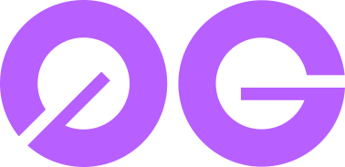
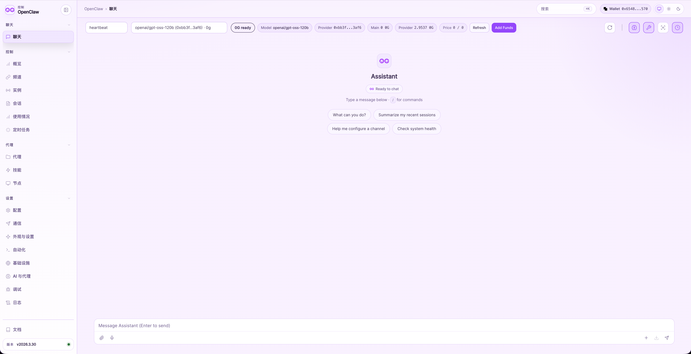

# 0G OpenClaw

English | [简体中文](README.zh-CN.md)

<p align="center">
  
</p>

**Your key. Your agent.**

0G OpenClaw is not just another AI tool that asks for an API key. It is a personal agent that follows your wallet.

- With one wallet and some $0G, you can bring back the same agent on any machine: the same memory, the same context, and the same identity.
- You do not need to buy a separate proprietary model API. You can use models from the 0G Compute Market directly, with output security backed by 0G TEE.
- It is built on top of OpenClaw, so you still get the full OpenClaw feature set.

This repository packages that product idea and the local KV workflow behind it in one workspace:

1. `0g_openclaw`: a customized OpenClaw codebase that integrates 0G Storage, 0G KV memory sync and restore, plus 0G Compute Network.
2. `0g-storage-kv-local`: a local copy of the 0G Storage KV node source used for reference, debugging, and source-build fallback.

The core objective of this project is simple: your agent should not turn into a brand-new assistant just because you changed computers, reinstalled your environment, or chose not to pay for centralized APIs. The wallet is the anchor, 0G is the memory rail, and OpenClaw becomes something you can rehydrate anywhere.

<p align="center">
  
</p>

Demo Video: https://www.youtube.com/watch?v=UQuXa4rrlTs

## Repository Layout

```text
0ghack/
├── README.md
├── README.zh-CN.md
├── .gitignore
├── 0g_openclaw/
└── 0g-storage-kv-local/
```

### `0g_openclaw/`

This is the main application repository. It is a Node.js and TypeScript monorepo centered on the OpenClaw CLI, gateway, UI, extensions, and mobile and desktop clients. It keeps the full OpenClaw capability set while adding the 0G-specific enhancements below:

- wallet and account awareness across the product flow,
- 0G memory upload and restore services,
- model serving switched to 0G Compute Network,
- local KV helper scripts under `scripts/dev/`.

### `0g-storage-kv-local/`

This is a local copy of the 0G Storage KV node source. It is included so the workspace contains everything needed to understand, inspect, and, when necessary, build the KV node from source.

Notes:

- This is a Rust workspace, not a pnpm package.
- It is not part of the OpenClaw pnpm workspace.
- The OpenClaw helper script prefers the official prebuilt `zgs_kv` binary on macOS and only falls back to a source build when necessary.

## 0G Memory Architecture

The memory sync design in this repository works like this:

1. OpenClaw scans local memory files and session transcripts.
2. Changed files are uploaded to 0G Storage.
3. A manifest describing those files is uploaded to 0G Storage.
4. A `latest-manifest` pointer is written to 0G KV.
5. Restore reads that KV pointer, downloads the manifest, and then downloads and rewrites the missing local files.

Conceptually:

```text
Local transcripts / memory
	|
	v
0G Storage blobs
	|
	v
Manifest in 0G Storage
	|
	v
latest-manifest pointer in 0G KV
	|
	v
Restore back into ~/.openclaw
```

Key behavior in this implementation:

- Memory sync is local-first, not cloud-first.
- Restore depends on deterministic stream IDs derived from the wallet address.
- Startup restore is intended to finish before local memory indexing starts, so restored files are immediately visible.
- If KV read support is missing, restore should skip safely instead of failing the whole setup.

## Setup and Development

### Prerequisites

For the OpenClaw side:

- Node.js 24 recommended
- pnpm

For the optional KV source-build path:

- Rust toolchain
- cargo
- platform-native build dependencies required by the 0G KV project

### Install OpenClaw dependencies

The root repository itself is not a pnpm workspace package. Application-side dependencies should be installed inside `0g_openclaw`:

```bash
cd 0g_openclaw
pnpm install
```

This is the supported way to install dependencies for the application side of the project.

### Typical local flow

```bash
cd 0g_openclaw
pnpm install

# Initial setup
pnpm openclaw onboard

# Start or verify a local KV node
scripts/dev/start-local-zerog-kv.sh

# Push local memory to 0G
pnpm openclaw zerog sync

# Pull remote memory back into local state
OPENCLAW_0G_KV_RPC_URL=http://127.0.0.1:6789 pnpm openclaw zerog restore
```

## Main User-Facing Commands

All OpenClaw commands should be run from inside `0g_openclaw`.

### Upload local memory to 0G

```bash
cd 0g_openclaw
pnpm openclaw zerog sync
```

This command uploads changed transcript and memory files and updates the remote manifest pointer.

### Manually restore memory from 0G

```bash
cd 0g_openclaw
OPENCLAW_0G_KV_RPC_URL=http://127.0.0.1:6789 pnpm openclaw zerog restore
```

If you want to overwrite matching local files intentionally:

```bash
cd 0g_openclaw
OPENCLAW_0G_KV_RPC_URL=http://127.0.0.1:6789 pnpm openclaw zerog restore --force
```

This command exists specifically for manual recovery, so users do not have to rely only on onboarding or startup timing to restore remote state into a clean local install.

## Local KV Workflow

The repository includes a set of helper scripts that make the OpenClaw-side local KV workflow practical:

- `0g_openclaw/scripts/dev/start-local-zerog-kv.sh`
- `0g_openclaw/scripts/dev/stop-local-zerog-kv.sh`
- `0g_openclaw/scripts/dev/openclaw-with-local-zerog-kv.sh`

### Start the local KV node

```bash
cd 0g_openclaw
scripts/dev/start-local-zerog-kv.sh
```

It does the following:

- reads the OpenClaw wallet from `~/.openclaw/credentials/ethereum-wallet.json`,
- derives the wallet address,
- derives the OpenClaw memory stream ID,
- generates a local KV configuration,
- prefers the official prebuilt `zgs_kv` macOS binary,
- falls back to a source build only when needed,
- starts a local KV RPC service.

### Run an OpenClaw command with the local KV RPC automatically wired in

```bash
cd 0g_openclaw
scripts/dev/openclaw-with-local-zerog-kv.sh pnpm openclaw zerog restore
```

This wrapper first makes sure the local KV service is running, then exports `OPENCLAW_0G_KV_RPC_URL`, and finally runs the command you pass to it.

## Current Recommended Operating Model

At the moment, the recommended restore model is:

1. Run OpenClaw locally.
2. Point it at a KV endpoint that actually supports `kv_getValue`.
3. Prefer onboarding or startup restore when they are available.
4. Use `openclaw zerog restore` when you want a deterministic manual pull.

This is especially useful after:

- reinstalling OpenClaw,
- switching machines,
- setting up a new local state directory,
- bringing a local self-hosted KV node online after it has finished replaying the relevant chain history.

## Notes on the Included 0G KV Source Tree

`0g-storage-kv-local` is included so the full local KV workflow is visible, inspectable, and reproducible inside one repository. It is useful for:

- code inspection,
- debugging,
- validating configuration formats,
- source builds when the prebuilt binary path is unavailable,
- making the hackathon submission more complete.

It should be treated as an included upstream source tree, not as a package inside the OpenClaw pnpm workspace.

## Provenance

- `0g_openclaw` is based on OpenClaw and then extended inside this hackathon workspace.
- `0g-storage-kv-local` is a local source copy of the 0G Storage KV repository.
- The included KV source snapshot currently corresponds to upstream commit `a5c209a`.

## License and Upstream Ownership

This repository contains multiple upstream codebases. Each subproject keeps its own license and attribution files. Please review the license files inside each subdirectory before redistributing or reusing code.
